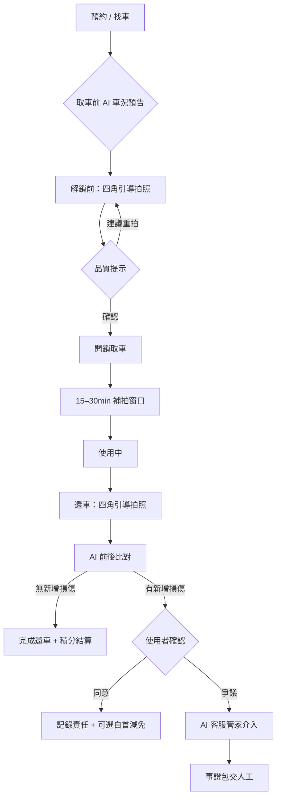
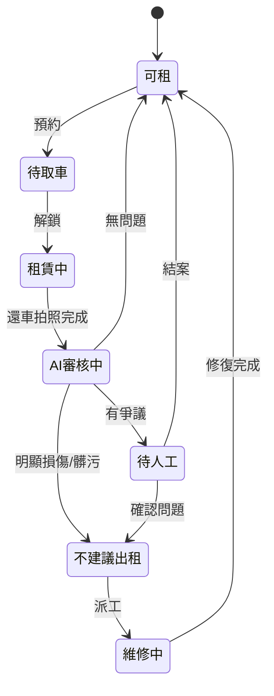

# PIG-13｜UX Flow：AI 輔助租車 + 還車流程設計

> 目標：設計加入 AI 後的新版租/還車使用者流程，整合 [實測報告](./PIG-8-實測報告.md) 第一手發現。
> 對應 Linear：[PIG-13](https://linear.app/pigeonpacket/issue/PIG-13)　｜　前端 PoC：[`demo/`](../demo/)（PIG-5）

> ⚠️ **狀態：Wireflow 初版** — 文字 + 流程圖；Figma 視覺稿待補。

---

## 1. 設計原則

| 原則 | 說明 | 來源 |
|------|------|------|
| **非阻擋優先** | 拍照引導、品質提示先給建議，不強制擋流程（降低摩擦） | 實測 §3.1 |
| **動機雙軌** | 防禦性存證（自保）+ 獎勵積分（主動） | 實測 §3.2 |
| **可補拍** | 開鎖後 15–30 分鐘內可補充租前照片 | 實測 §3.3 |
| **即時營運** | AI 判斷後即時影響車輛可租狀態與下一位預告 | 實測 §3.4 |
| **一條故事線** | 取車建基準 → 還車比對 → 爭議時客服管家 | PIG-10 |

---

## 2. 全流程總覽



---

## 3. 分階段 Wireflow

### Screen 0 — 預約 / 取車前預告

**目的**：降低取車落差（痛點 R2）；讓使用者帶著預期來拍照。

| 元素 | 內容 |
|------|------|
| 車況摘要卡 | AI 綜合上一輪還車紀錄：整潔度、油量、已知舊損位置（縮圖） |
| 風險標籤 | 「待確認」「不建議預約」— 營運即時狀態 |
| CTA | 繼續取車 / 換一台 |

---

### Screen 1 — 取車：四角引導拍照（PIG-5 核心）

**對應 PoC**：[`demo/`](../demo/)

| 步驟 | 畫面 | 互動 |
|:--:|------|------|
| 1/4 | 左前 45° | 相機 + 車身虛線輪廓 overlay；頂部進度條 |
| 2/4 | 右前 45° | 同上，切換模板 |
| 3/4 | 左後 45° | 同上 |
| 4/4 | 右後 45° | 同上 |
| — | 儀表板 / 車內（可選） | 開鎖前能拍的先拍；車內標「可稍後補拍」 |

**品質提示（非阻擋）**

- 太暗 / 過曝 / 模糊 → 底部黃條：「建議重拍，光線/對焦不佳」
- 角度偏離 → 「請對準虛線輪廓」
- 仍可點「先繼續」— 但積分加成較少

**動機 UI**

```
┌─────────────────────────────────────┐
│ 🛡️ 認真拍照可保護你免於還車爭議      │
│ ⭐ 完整四角拍照 +20 積分（可折抵租金） │
└─────────────────────────────────────┘
```

---

### Screen 2 — 開鎖後補拍窗口（15–30 分鐘）

**觸發**：解鎖成功後，底部浮層或 Push：「發現車內問題？15 分鐘內可補拍存證」

| 可補拍類型 | 說明 |
|------------|------|
| 車內整潔 | 前座、後座、置物空間 |
| 異味/垃圾 | 特寫 + 廣角 |
| 取車時拍不清的車身 | 重拍某一角 |
| 新發現損傷 | 特寫 + 定位廣角 |

**規則**

- 倒數計時可見；逾時後僅能走客服通報（非正式存證鏈）
- 補拍照片**合併進租前基準**，標記時間戳「補拍」
- 完整補拍額外積分

---

### Screen 3 — 使用中（被動）

- 無強制互動
- 可從 App 內隨時「回報車況異常」→ 跳轉精簡拍照 + AI 初判 → **即時標記車輛狀態**（營運面）

---

### Screen 4 — 還車：四角引導拍照

與 Screen 1 **同一套 UI**（PIG-5 複用），文案改為：

```
🛡️ 還車前拍照，證明你交還時車況正常
⭐ 完整拍照 +20 積分
```

拍完後 → 自動進入 AI 比對，不需使用者手動觸發。

---

### Screen 5 — AI 前後比對結果

| 結果 | 畫面 | 下一步 |
|------|------|--------|
| ✅ 無新增損傷 | 並排縮圖 + 綠色勾；積分結算 | 一鍵還車完成 |
| ⚠️ 疑似新增 | 高亮框標記差異區；「請確認是否為本次造成」 | 確認 / 爭議 |
| 🔴 明顯新增 | 同上 + 強調；提供「誠實申報減免」入口 | 確認 / 爭議 / 自首 |

**自首減免（獎勵機制延伸）**

- 主動承認本次造成損傷 → 簡化賠償流程 + 積分不降為零（減刑邏輯）
- 鼓勵誠實，減少隱瞞導致的下一位踩雷

---

### Screen 6 — 爭議：AI 客服管家

**觸發**：使用者在 Screen 5 點「我有爭議」

| 步驟 | AI 行為 |
|------|---------|
| 1 | 自動彙整：取車基準圖、補拍圖、還車圖、時間軸、比對 diff |
| 2 | 對話式引導：「請描述您認為有爭議的部分」 |
| 3 | RAG 引用 iRent FAQ / 條款 |
| 4 | 輸出「事證包」給人工客服（若無法自動結案） |

---

## 4. 營運側狀態機（車輛）



**下一位預告**：`不建議出租` / `待人工` 狀態在預約列表顯示風險，避免到場才發現。

---

## 5. 積分規則（初版假設）

| 行為 | 積分 | 備註 |
|------|:----:|------|
| 取車四角完整 + 品質達標 | +20 | 品質達標 = 無黃條警告 |
| 15min 內補拍完整 | +10 | 可疊加 |
| 還車四角完整 + 品質達標 | +20 | |
| 誠實申報損傷 | +5 | 減刑激勵 |
| 亂拍通過（有警告仍跳過） | +5 | 仍有基礎分，鼓勵至少拍 |

積分用途：租車費折抵（具體比例待商業設計）。

---

## 6. 與其他 PIG 的對應

| 本文件章節 | 對應 |
|----------|------|
| Screen 1 / 4 | PIG-5 前端 PoC |
| Screen 5 比對 | PIG-6 後端 + PIG-12 技術選型 |
| Screen 6 | PIG-10 AI 客服管家 |
| §4 狀態機 | PIG-11 商業價值（營運效率） |

---

## 7. 待辦（Figma 階段）

- [ ] 將 Screen 0–6 轉為 Figma wireflow（手機框架 390×844）
- [ ] 虛線輪廓依 1–2 款主力車型出圖
- [ ] 比對結果頁的 diff 高亮視覺規範
- [ ] 與團隊 review 積分規則與自首減免文案（法務/營運視角）
