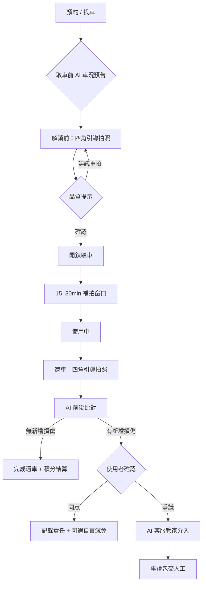
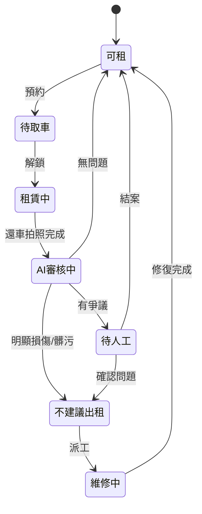

# PIG-13｜UX Flow：AI 輔助租車 + 還車流程設計

> 目標：設計加入 AI 後的新版租/還車使用者流程，整合 [實測報告](./PIG-8-實測報告.md) 第一手發現。
> 對應 Linear：[PIG-13](https://linear.app/pigeonpacket/issue/PIG-13)　｜　前端原型：[`demo/`](../demo/)（PIG-5）・輪廓驗證頁 [`guide-lab.html`](../demo/guide-lab.html)

> **狀態：Wireflow + 可點擊原型** — Screen 0–6 已於 [`demo/`](../demo/) 實作；§1.2 為原型實作後量測回填的幾何硬需求。
> ⚠️ Figma 視覺稿仍待補。

---

## 1. 設計原則

### 1.1 體驗原則（設計階段）

| 原則 | 說明 | 來源 |
|------|------|------|
| **非阻擋優先** | 拍照引導、品質提示先給建議，不強制擋流程（降低摩擦） | 實測 §3.1 |
| **動機雙軌** | 防禦性存證（自保）+ 獎勵積分（主動） | 實測 §3.2 |
| **可補拍** | 開鎖後 15–30 分鐘內可補充租前照片 | 實測 §3.3 |
| **即時營運** | AI 判斷後即時影響車輛可租狀態與下一位預告 | 實測 §3.4 |
| **一條故事線** | 取車建基準 → 還車比對 → 爭議時客服管家 | PIG-10 |
| **幾何先行** | 站位、畫面方向、輪廓內容是量出來的硬需求，不是視覺偏好 | 原型實測 §1.2 |

### 1.2 拍照幾何硬需求（原型實作後回填）

> 以下每條都是原型實作過程**量測**的結果。基準相機：**距離 3.85 m、機高 1.5 m、等效焦距 26 mm、方位角 45°、4:3 橫向**（`demo/assets/car-reference/generated/build-report.json`）。

| # | 硬需求 | 為什麼 |
|:--:|------|--------|
| **G1** | 汽車四角**必須橫向 4:3** 拍攝 | 直向要讓全車入鏡需退到 **4.2 m 以上**，一般停車格退不到 —— 這是幾何限制不是偏好。已定案：**只有四角拍照強制橫向，App 其餘畫面維持直向**。 |
| **G2** | 站位需有明確規範（下方站位表） | 原設計只寫「對準虛線輪廓」而無距離規範，但距離正是輪廓能否成立的前提。 |
| **G3** | 引導文案**偏向「請往後退」** | 誤差敏感度不對稱：**太近的代價是太遠的八倍**（下方敏感度表）。 |
| **G4** | 輪廓**不能只有外框剪影** | 車窗帶、輪拱、燈組線是使用者判斷「我站對了嗎」的主要依據；其中**輪胎接地點與地面線對相機高度最敏感**，是垂直校正最有效的線索。屬功能需求，非視覺裝飾。 |
| **G5** | 線條樣式：主輪廓實線、內部細節虛線、**對準後全轉實線並變綠** | 線重必須覆寫並加 `vector-effect="non-scaling-stroke"` —— 原始 `stroke-width:1` 在 500 寬 viewBox 上，到 390 px 手機只剩 0.78 px（次像素）。白線需**深色 halo 墊底**，否則在白車或亮地面上會消失。 |
| **G6** | 對齊判定**寬鬆**並給正向回饋 | 業界作法（Monk SDK 的 `useLiveCompliance` 預設關閉）是疊圖只負責把人哄到大致正確的位置，合格與否交給**拍後檢查 + 重拍迴圈**，不用即時幾何判定卡住使用者。與 §1.1「非阻擋優先」一致。 |
| **G7** | 引導輪廓**必須自建**，不可借用他人 2D 成品 | 2D 疊圖是「站位鎖定」的，無法重新投影 —— 見下方實測。 |

**站位規範（G2）**

| 車種 | 水平距離 | 相機高 | 等效焦距 | 畫面 |
|------|:--------:|:------:|:--------:|------|
| 轎車（Altis 級） | **3.6–3.9 m** | 1.5 m（胸口平舉） | 26 mm | 4:3 橫向 |
| CUV（RAV4 / Corolla Cross 級） | **3.7–3.9 m** | 同上 | 同上 | 4:3 橫向 |
| 機車 | **1.6 m** | 同上 | 同上 | 不受 G1 限制 |

**誤差敏感度（G3）** — 角點偏差 = 車體外接框角點位移 ÷ 車寬

| 偏離基準 | 角點偏差 |
|----------|:--------:|
| 站太近 2.5 m | 🔴 **85%** |
| 站太遠 3.8 m | 🟢 11% |
| 相機高 1.3 vs 1.5 m | 🟢 11% |
| 鏡頭 24 vs 26 mm | 🟢 8% |

→ **手機鏡頭差異幾乎不必管**（8%）；反之太近的代價是太遠的八倍，所以引導文案一律偏向**叫人往後退**。

<sub>此表為站位敏感度的獨立分析結論，基準與定義和上方 3.85 m 渲圖相機不完全相同（`guide-lab.html` 內同表亦如此註記），看**相對量級**即可。</sub>

**G7 的依據：2D 疊圖是站位鎖定的**

把 Monk（MonkVision，開源 BSD-3-Clause-Clear）釋出的 CUV 疊圖套進我們的站位實測：

| 比較對象 | 對稱 rms（佔車寬） |
|----------|:------------------:|
| Monk CUV 疊圖（前兩角） | 15.8–16.1% |
| **橢圓控制組** | **15.7–15.8%** |
| 自建輪廓（指標下限，與基準真值同源） | 0.3–0.4% |

Monk 的成品與「一個橢圓」在統計上分不開。誤差拆解：**機位差 18.8% 車寬、車款差僅 3.1% 車寬 → 約 85% 的誤差來自站位不同，車款不同只佔約 15%**。
⇒ 引導輪廓必須**從 3D 模型、用自己的相機參數生成**，借用他人成品無效。（完整量測見 [`demo/assets/guides/monk/NOTICE.md`](../demo/assets/guides/monk/NOTICE.md) §6）

**尚未驗證 / 誠實邊界**

- 🟡 **輪廓對真實車輛的保真度尚未獨立驗證** —— 目前的比較基準是同一顆 3D 模型的渲圖，屬**自我一致性檢查**。需在目標站位實拍四張校正照才能驗（[`guide-lab.html`](../demo/guide-lab.html) 即為此準備）。
- 🟡 引導輪廓所用 3D 模型的上游權利鏈有殘餘不確定性，見 [`ATTRIBUTION.md`](../demo/assets/car-reference/ATTRIBUTION.md) §3.4。
- 🔴 **不主張「疊圖使照片良率提升 X%」** —— 查無公開研究支持此類數字，找得到的都是廠商行銷數字，且衡量的是成本與時效而非照片良率。可用的論據是**業界趨同行為本身**（B2B AI 驗車廠商普遍採用引導疊圖）與**上述我們自己量出的幾何數字**。

---

## 2. 全流程總覽



---

## 3. 分階段 Wireflow

### Screen 0 — 預約 / 取車前預告

**目的**：降低取車落差（痛點 R2）；讓使用者帶著預期來拍照。

| 元素 | 內容 |
|------|------|
| 車況摘要卡 | AI 綜合上一輪還車紀錄：整潔度、油量、已知舊損位置（縮圖） |
| 風險標籤 | 「待確認」「不建議預約」— 營運即時狀態 |
| CTA | 繼續取車 / 換一台 |

---

### Screen 1 — 取車：四角引導拍照（PIG-5 核心）

**對應原型**：[`demo/`](../demo/)　｜　**此畫面強制橫向 4:3**（§1.2 G1），App 其餘畫面維持直向。

| 步驟 | 畫面 | 互動 |
|:--:|------|------|
| 1/4 | 左前 45° | 相機 + 車體輪廓 overlay（主輪廓實線＋細節虛線，§1.2 G4/G5）；頂部進度條 |
| 2/4 | 右前 45° | 同上，切換模板 |
| 3/4 | 左後 45° | 同上 |
| 4/4 | 右後 45° | 同上 |
| — | 儀表板 / 車內（可選） | 開鎖前能拍的先拍；車內標「可稍後補拍」 |

**站位提示**：進場先給距離指引（轎車 3.6–3.9 m / CUV 3.7–3.9 m、手機胸口平舉，§1.2 站位表）。

**品質提示（非阻擋）**

- 太暗 / 過曝 / 模糊 → 底部黃條：「建議重拍，光線/對焦不佳」
- 站位偏離 → 「再往後退一步，讓全車進入輪廓」（文案偏向後退，理由見 §1.2 G3）
- 對準後輪廓全轉實線變綠 —— 判定寬鬆、以正向回饋為主（§1.2 G6）
- 仍可點「先繼續」— 但積分加成較少

**動機 UI**

```
┌─────────────────────────────────────┐
│ 🛡️ 認真拍照可保護你免於還車爭議      │
│ ⭐ 完整四角拍照 +20 積分（可折抵租金） │
└─────────────────────────────────────┘
```

---

### Screen 2 — 開鎖後補拍窗口（15–30 分鐘）

**觸發**：解鎖成功後，底部浮層或 Push：「發現車內問題？15 分鐘內可補拍存證」

| 可補拍類型 | 說明 |
|------------|------|
| 車內整潔 | 前座、後座、置物空間 |
| 異味/垃圾 | 特寫 + 廣角 |
| 取車時拍不清的車身 | 重拍某一角 |
| 新發現損傷 | 特寫 + 定位廣角 |

**規則**

- 倒數計時可見；逾時後僅能走客服通報（非正式存證鏈）
- 補拍照片**合併進租前基準**，標記時間戳「補拍」
- 完整補拍額外積分

---

### Screen 3 — 使用中（被動）

- 無強制互動
- 可從 App 內隨時「回報車況異常」→ 跳轉精簡拍照 + AI 初判 → **即時標記車輛狀態**（營運面）

---

### Screen 4 — 還車：四角引導拍照

與 Screen 1 **同一套 UI**（PIG-5 複用），文案改為：

```
🛡️ 還車前拍照，證明你交還時車況正常
⭐ 完整拍照 +20 積分
```

拍完後 → 自動進入 AI 比對，不需使用者手動觸發。

---

### Screen 5 — AI 前後比對結果

| 結果 | 畫面 | 下一步 |
|------|------|--------|
| ✅ 無新增損傷 | 並排縮圖 + 綠色勾；積分結算 | 一鍵還車完成 |
| ⚠️ 疑似新增 | 高亮框標記差異區；「請確認是否為本次造成」 | 確認 / 爭議 |
| 🔴 明顯新增 | 同上 + 強調；提供「誠實申報減免」入口 | 確認 / 爭議 / 自首 |

**自首減免（獎勵機制延伸）**

- 主動承認本次造成損傷 → 簡化賠償流程 + 積分不降為零（減刑邏輯）
- 鼓勵誠實，減少隱瞞導致的下一位踩雷

---

### Screen 6 — 爭議：AI 客服管家

**觸發**：使用者在 Screen 5 點「我有爭議」

| 步驟 | AI 行為 |
|------|---------|
| 1 | 自動彙整：取車基準圖、補拍圖、還車圖、時間軸、比對 diff |
| 2 | 對話式引導：「請描述您認為有爭議的部分」 |
| 3 | RAG 引用 iRent FAQ / 條款 |
| 4 | 輸出「事證包」給人工客服（若無法自動結案） |

---

## 4. 營運側狀態機（車輛）



**下一位預告**：`不建議出租` / `待人工` 狀態在預約列表顯示風險，避免到場才發現。

---

## 5. 積分規則（初版假設）

| 行為 | 積分 | 備註 |
|------|:----:|------|
| 取車四角完整 + 品質達標 | +20 | 品質達標 = 無黃條警告 |
| 15min 內補拍完整 | +10 | 可疊加 |
| 還車四角完整 + 品質達標 | +20 | |
| 誠實申報損傷 | +5 | 減刑激勵 |
| 亂拍通過（有警告仍跳過） | +5 | 仍有基礎分，鼓勵至少拍 |

積分用途：租車費折抵（具體比例待商業設計）。

---

## 6. 與其他 PIG 的對應

| 本文件章節 | 對應 |
|----------|------|
| §1.2 幾何硬需求 | PIG-5 輪廓生成 + [`guide-lab.html`](../demo/guide-lab.html) 驗證頁 |
| Screen 1 / 4 | PIG-5 前端原型 |
| Screen 5 比對 | PIG-6 後端 + PIG-12 技術選型 |
| Screen 6 | PIG-10 AI 客服管家 |
| §4 狀態機 | PIG-11 商業價值（營運效率） |

---

## 7. 待辦

- [x] Screen 0–6 全數以可點擊原型實作（[`demo/`](../demo/)，八個畫面一鏡到底）
- [x] 輪廓依車型出圖 — 已用 **Toyota Corolla Cross（XG10）** 3D 模型生成四角輪廓（`demo/assets/car-reference/generated/`），另有 [`guide-lab.html`](../demo/guide-lab.html) 供實車驗證
- [ ] 將 Screen 0–6 轉為 Figma **視覺稿**（手機框架 390×844；四角拍照為橫向 844×390）
- [ ] 到 iRent 停車格用目標站位實拍四張校正照，驗證輪廓對**實車**的保真度（§1.2）
- [ ] 比對結果頁的 diff 高亮視覺規範
- [ ] 與團隊 review 積分規則與自首減免文案（法務/營運視角）
